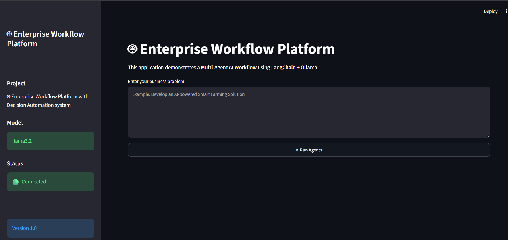
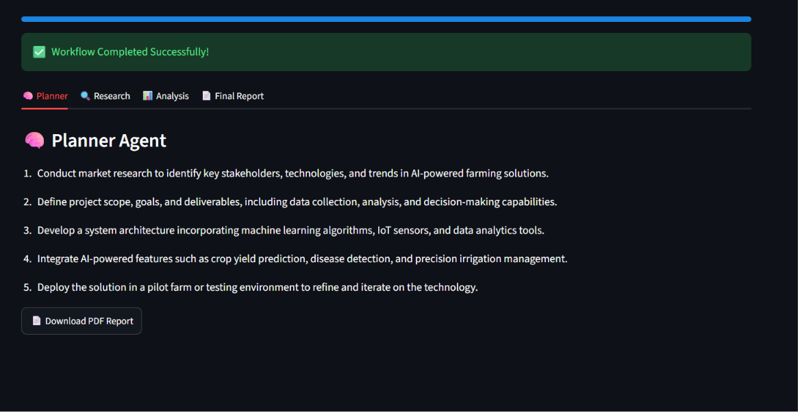
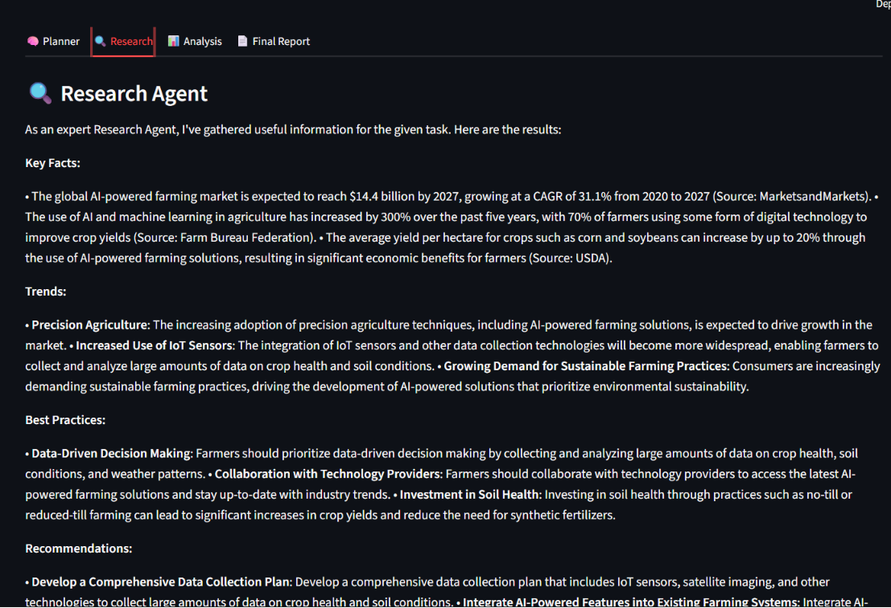
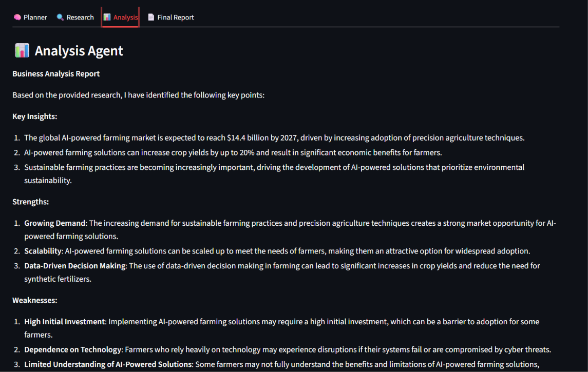
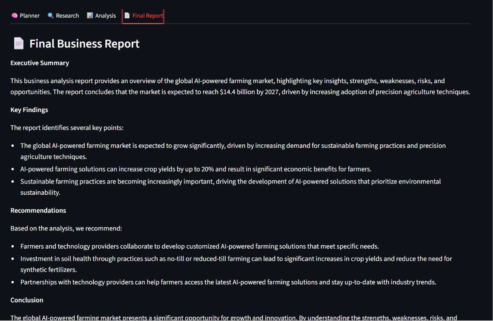
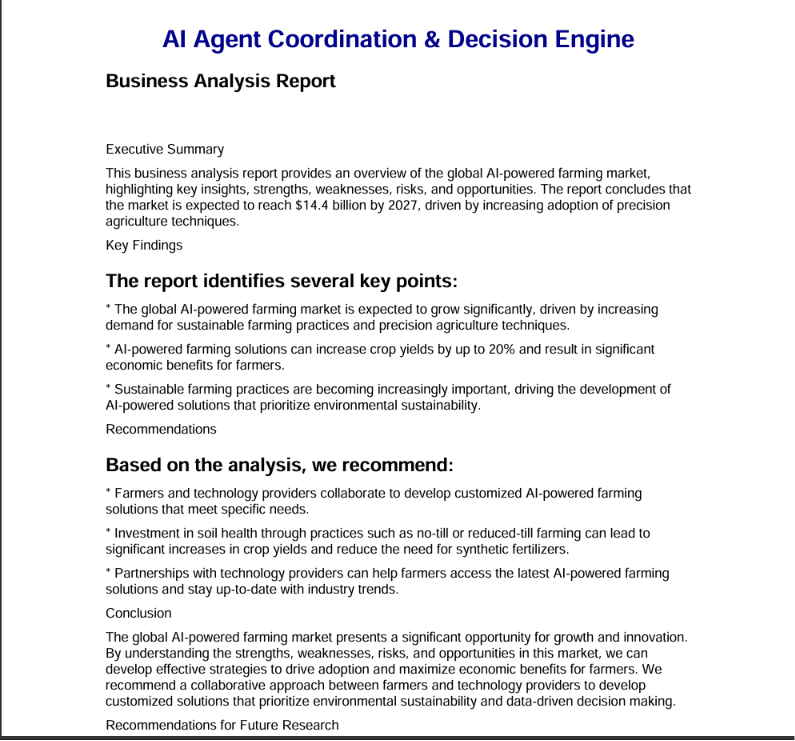

# 🤖 Development of Enterprise Workflow Platform with Decision Automation System

## 📌 Project Overview

The Development of Enterprise Workflow Platform with Decision Automation System is a Multi-Agent AI platform developed using LangChain, Ollama, and Streamlit.

The platform automates enterprise workflows by coordinating multiple AI agents responsible for planning, intelligent tool selection, research, analysis, decision making, memory management, and professional report generation.

---

## 🚀 Features

### 🤖 Multi-Agent AI Workflow

- 🧠 Planner Agent
- 🔍 Research Agent
- 📊 Analysis Agent
- 📄 Response Agent
- 🤝 Agent Coordinator

### 🛠 Tool Integration (Milestone 2)

- 🧮 Calculator Tool
- 🔍 Search Tool
- 🌦 Weather Tool
- 📄 File Tool
- ⚙️ Intelligent Tool Selector

### 🧠 Memory Management (Milestone 3)

- 💬 Conversation Memory
- 🤝 Shared Memory
- 💾 Long-Term Memory
- 🔄 Context-Aware Agents
- 📜 Memory Dashboard

### 📑 Reporting

- 📄 Professional PDF Report Generation

### 💻 User Interface

- 🌐 Streamlit Dashboard
- 📑 Planner Tab
- 🛠 Tool Tab
- 🔍 Research Tab
- 📊 Analysis Tab
- 🧠 Memory Tab
- 🤝 Shared Memory Tab
- 📄 Final Report Tab


### 🤖 AI Model

- ⚡ Local LLM using Ollama (Llama 3.2)

## 🛠️ Technologies Used

- Python
- LangChain
- Ollama
- Streamlit
- ReportLab
- Git & GitHub

---

## 📂 Project Structure

AI-Agent-Coordination/
│
├── agents/
│   ├── planner_agent.py
│   ├── research_agent.py
│   ├── analysis_agent.py
│   └── response_agent.py
│
├── memory/
│   ├── conversation_memory.py
│   ├── shared_memory.py
│   ├── long_term_memory.py
│   └── history.json
│
├── tools/
│   ├── calculator.py
│   ├── search_tool.py
│   ├── weather_tool.py
│   ├── file_tool.py
│   └── tool_selector.py
│
├── workflows/
│   └── coordinator.py
│
├── prompts/
├── reports/
├── tests/
├── ui/
│   └── streamlit_app.py
│
├── config.py
├── requirements.txt
└── README.md
---
## 🧠 Memory Architecture

The project implements three types of memory for efficient agent collaboration.

### 💬 Conversation Memory
Stores the current conversation between the user and all AI agents.

### 🤝 Shared Memory
Allows agents to exchange intermediate outputs such as:
- Plan
- Tool Output
- Research
- Analysis
- Final Response

### 💾 Long-Term Memory
Stores conversation history in a JSON file, enabling persistent memory across sessions.

## ⚙️ Installation

### Clone Repository

```bash
git clone https://github.com/sahanampujar/AI-Agent-Coordination-and-Decision-Engine.git
```

### Install Dependencies

```bash
pip install -r requirements.txt
```

### Start Ollama

```bash
ollama run llama3.2
```

### Run the Application

```bash
streamlit run ui/streamlit_app.py
```

---

## 🔄 Workflow

```text
Business Problem
        │
        ▼
 Planner Agent
        │
        ▼
 Tool Selector
        │
        ▼
 Calculator / Search / Weather / File Tool
        │
        ▼
 Research Agent
        │
        ▼
 Analysis Agent
        │
        ▼
 Response Agent
        │
        ▼
 Business Report (PDF)
```
---

# 📸 Project Screenshots

## 🏠 Home Page



---

## 🧠 Planner Agent



---

## 🔍 Research Agent



---

## 📊 Analysis Agent



---

## 📄 Final Report



---

## 📑 Generated PDF



## 🎯 Milestone 1 Completed

- ✅ LangChain Setup
- ✅ Ollama Integration
- ✅ Planner Agent
- ✅ Research Agent
- ✅ Analysis Agent
- ✅ Response Agent
- ✅ Agent Coordinator
- ✅ Streamlit UI
- ✅ PDF Report Generation
- ✅ GitHub Integration

### ✅ Milestone 2 – Tool Integration & Action Execution

- Calculator Tool
- Search Tool
- Weather Tool
- File Tool
- Intelligent Tool Selector
- Tool Invocation Workflow
- Action Execution Validation

### ✅ Milestone 3 – Agent Coordination & Memory Systems

- Conversation Memory
- Shared Memory
- Long-Term Memory
- Context-Aware Agents
- Agent Communication
- Memory Dashboard
- Collaborative Workflow Validation

---

## 🏆 Project Status

✅ Milestone 1 Completed

✅ Milestone 2 Completed

## 👩‍💻 Developed By

**Sahana M Pujar**

Information Science Engineering

Basaveshwar Engineering College, Bagalkote
---

## 🆕 Enterprise Platform Additions (Milestones 4–5)

This section documents what was added on top of the existing
Milestone 1–3 implementation to complete the Enterprise Workflow
Platform with Decision Automation requirements. See `GAP_ANALYSIS.md`
for the full requirement-by-requirement status.

### 🐞 Critical bug fix: false "Workflow Completed Successfully!"

**Root cause found:** in `workflow_executor.py`'s step dispatcher, a
Research step (component `"Research Agent"`) was matched by
`"search" in component` *before* it reached the Research branch,
because the string `"research"` contains `"search"` as a literal
substring (`"re" + "search"`). This silently ran the **Search Tool**
instead of the **Research Agent**, storing its output under
`results["tool"]` and never setting `results["research"]` — with no
error raised. The step showed COMPLETED, the workflow showed
COMPLETED, and the Research tab showed nothing.

**Fix:** step routing now checks `step_type` for exact equality first,
and falls back to a **word-boundary** regex match on `component`
(`core/exceptions.py` helper `_word_in`) instead of plain substring
matching, so `"search"` can never falsely match inside `"research"`.

On top of that, every agent (`agents/*.py`) now raises
`AgentExecutionError` instead of catching its own errors and returning
a placeholder string — closing the second way a failure could hide
from the executor's status check.

### 🔁 Resilience: retries, timeouts, honest failure

- Per-step timeout (`STEP_TIMEOUT_SECONDS`, default 60s), enforced via
  a bounded worker thread.
- Automatic retry (`STEP_MAX_RETRIES`, default 1) for transient
  agent/tool failures — not for validation-type errors.
- The workflow **never** reports `COMPLETED` unless every step
  actually completed; failures stop the pipeline immediately and
  report the real failing step.

### 🗄️ Persistent database (SQLite by default, swappable via `DATABASE_URL`)

`workflows`, `workflow_runs`, `workflow_steps`, `decisions`,
`approvals`, `audit_logs`, `reports`, `users` — see `database/models.py`
and `database/repository.py`.

### 🧑‍⚖️ Human-in-the-loop review

A `REVIEW` decision now **pauses** the workflow (status
`PENDING_REVIEW`) instead of forcing a Response. A reviewer approves
or rejects from the Streamlit "Approvals" page or
`POST /api/runs/{run_id}/decision`; approving resumes and completes
the run, rejecting marks it `REJECTED`.

### 🌐 REST API (FastAPI) — `api/main.py`

```
GET  /api/health
POST /api/workflows                       build (don't run) a workflow
GET  /api/workflows
GET  /api/workflows/{id}
POST /api/workflows/{id}/execute
POST /api/workflows/execute               build + execute in one call
GET  /api/runs
GET  /api/runs/{id}
GET  /api/decisions/{id}
GET  /api/approvals/pending
POST /api/runs/{run_id}/decision          approve / reject
POST /api/runs/{run_id}/reports           generate pdf/docx/xlsx/json
GET  /api/runs/{run_id}/reports/{type}/download
GET  /api/audit-logs
GET  /api/dashboard/metrics
```

Run with: `uvicorn api.main:app --reload --port 8000` (docs at
`/docs`). Optional bearer-token auth via `API_AUTH_TOKEN` in `.env`.

### 📊 Dashboard & 📜 Audit Log (Streamlit)

New pages: `ui/pages/1_Dashboard.py` (totals, success/fail counts,
approval/rejection/review rates, avg execution time, step failure
breakdown, run history) and `ui/pages/2_Approvals.py` (review queue).
A new "Audit Log" tab was added to the main app.

### 📑 Multi-format reports

`reports/docx_generator.py`, `reports/xlsx_generator.py`,
`reports/json_generator.py` (PDF already existed) — orchestrated by
`reports/report_manager.py`, which saves each report under
`reports_output/{run_id}.{ext}` (no more overwriting the same fixed
filename) and registers it in the `reports` table.

### 🔒 Security fixes

- `tools/calculator.py` no longer uses `eval()` — replaced with an
  AST-based evaluator that only allows numeric literals and basic
  arithmetic operators.
- `requirements.txt` was missing `reportlab`, `langchain-google-genai`,
  and `fastapi` despite the existing code depending on them — fixed.
- **If you're reusing this repo:** the original `.env` file that
  shipped with this project contained a real Gemini API key. It has
  been replaced with a placeholder in this version — rotate/revoke
  that key if it was ever committed or shared anywhere.

### 🧪 Tests

`tests/conftest.py`, `tests/test_agents.py`, `tests/test_tools.py`,
`tests/test_decision_engine.py`, `tests/test_workflow_executor.py`,
`tests/test_database.py`, `tests/test_api.py`, `tests/test_reports.py`
— all mock the LLM (no real network calls), covering success paths,
per-step failure propagation, empty/invalid workflows, timeouts,
retries, and the human-review pause/resume flow. The original
hand-run manual scripts were moved to `tests/manual/` (they call a
real Gemini/Ollama endpoint and aren't pytest-compatible as written).

Run: `pytest tests/ -v` (does not run `tests/manual/`).

### 🚀 Deployment

See `DEPLOYMENT.md`. Includes `Dockerfile`, `docker-compose.yml`,
`.env.example`, and a security/scaling checklist.
